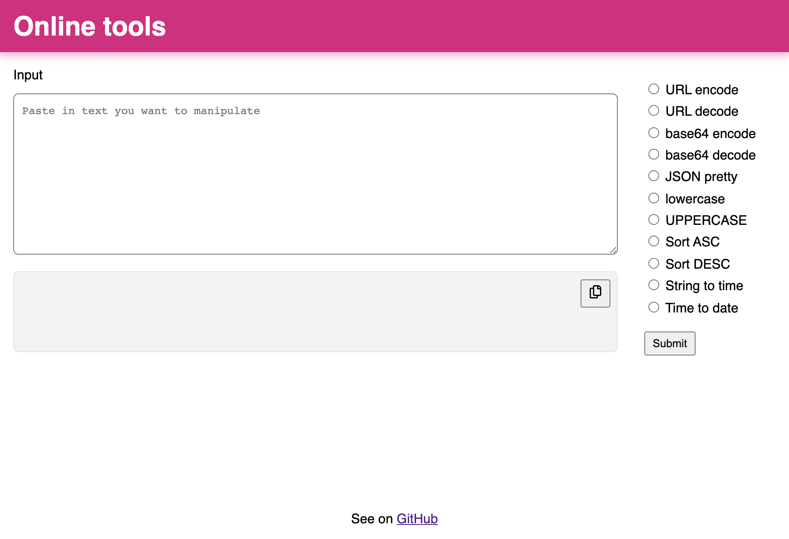

# Online tools
Online tools which are helpful for debugging web-related things and problems. See on [tools.haukurh.dev](https://tools.haukurh.dev).

## Version v2

This is an update to a long-lived project, which was originally written in PHP (see v1), the site has been completely
rewritten and all the functionality is in JavaScript meaning that it's all-in-browser.
There for no data sent over the wire and no processing on the server side.

## Screenshot

## Utilities

__Encode/Decode__

- URL
- base64
- JSON

__Text manipulation__

- Lowercase
- Uppercase
- Sort ASC / DESC

__Date__

- UNIX time to date
- Date to UNIX time

__Other__

- DNS TXT split

## Icons

This site uses an icon from [FontAwesome](https://fontawesome.com/v5.15/icons/copy?style=regular).
